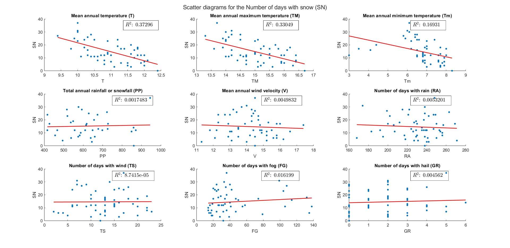

# Data-Analysis
The committed exercises and project in MATLAB for the course of "Data Analysis" in the academic year 2022-2023.

## Course project
For the project, statistical analysis was conducted on weather data (e.g. temperature, snow, hail etc.)  for the Heathrow airport in the time period 1949–1958 and 1973 – 2017.

As part of the project, it is examined whether the variable 'days with snow' is well explained by other weather variables. 

To do so, the number of days with snow is plotted against all other weather variables. A linear curve is fit for all pairs (snow as the dependent variable, another_weather_metric as the independent variable) and the coefficient of determination ($`R^2`$) is derived for each one.  

As the image shows, among all weather data variables, the best predictor for the days with snow (highest $`R^2`$ value) is the mean annual temperature with a value of 0.37296. This means that approximately 37% of the variation of the days with snow can be explained by the mean annual temperature. This percentage is very low (<80%) making the linear fit of the temperature not a good predictor for the days with snow.

## Teaching material
The repository also contains the Data Analysis teaching material during the academic year 2022-2023 (see folder lectures).
